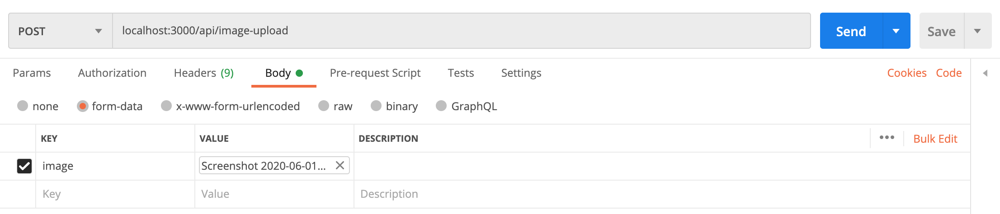

#How to use it. 

All the code is in imageUpload folder

Step 1:

`npm install —-save multer multer-s3 aws-sdk` 

Step 2: Add following keys in your .env file

AWS_SECRET_ACCESS_KEY
AWS_ACCESS_KEY_ID
AWS_REGIONAWS_BUCKET_NAME 

Step 3: Link it to your index.js

`const imageUploadRoute = require('./ imageUpload/route')`

`app.use(imageUploadRoute)`

Step 4: How to test?

Do a POST call to url admin url. 
E.g. localhost:3000/api/image-upload. With image as the key.

`curl --location --request POST 'localhost:3000/api/image-upload' \
--form 'image=@/image.jpg'`

